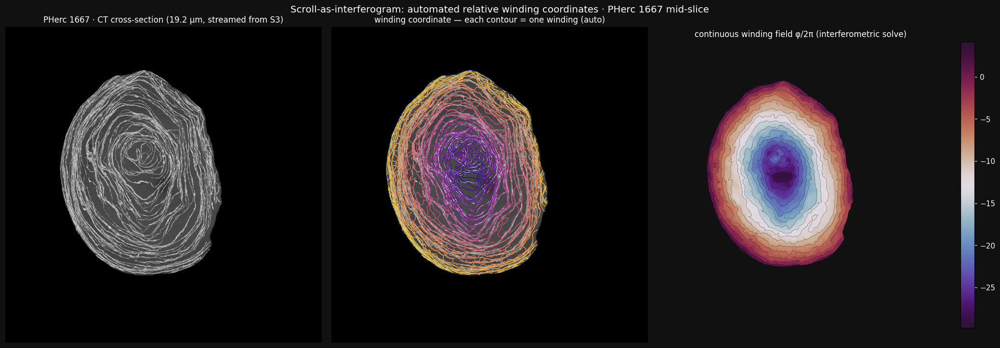
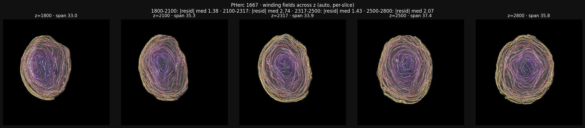
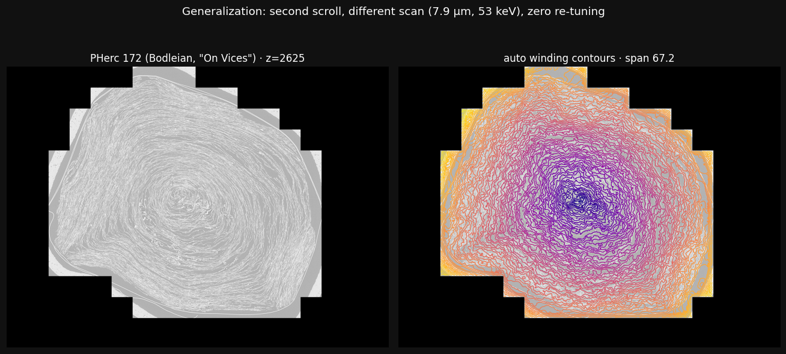
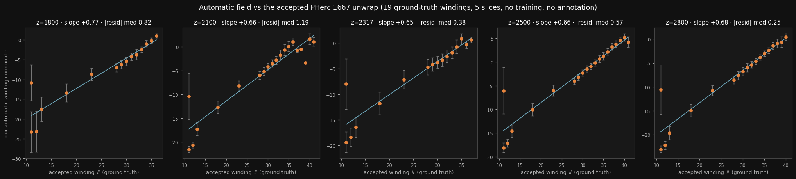
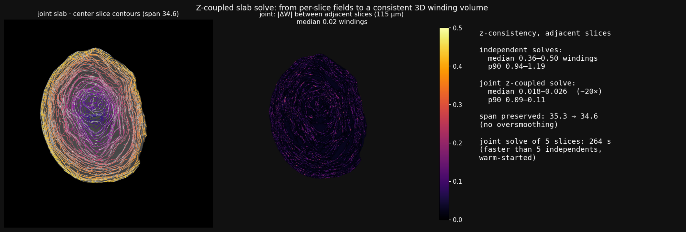
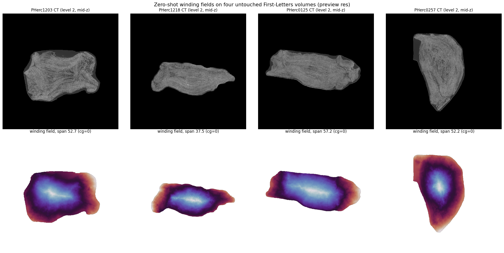

# scroll-interferometry

**Automated relative winding annotations for Herculaneum scrolls, by treating the
CT cross-section as an interferogram.**

Work-in-progress toward Vesuvius Challenge Open Problem #6 (winding-number
automation — "automating relative winding number annotations will boost
scalability by a great extent").



## The idea

A scroll cross-section is a fringe pattern: the rolled papyrus sheet is
quasi-periodic, **one winding = one fringe**, and *relative winding number* — the
annotation the spiral-fitting pipeline needs and currently gets from human
annotators — **is fringe order**. That imports the RF/SAR-interferometry toolbox
wholesale:

1. **Structure tensor** → local sheet-normal orientation + coherence (a quality
   map for free).
2. **Multi-band steered Riesz quadrature** → local spatial frequency
   |k| = 2π / winding spacing. Per-pixel dominant-band selection avoids the
   low-frequency bias of any single band in densely packed zones.
3. **Ridge-adjacency constraints** — detect sheet ridges, march along the outward
   normal to the next ridge, emit a "+2π between these two points" pairwise term.
   *These are relative winding annotations, generated automatically.* They fix
   the classic isolated-fringe undercount: a lone sheet in a wide gap swings
   quadrature phase by π, not 2π; the discrete term restores the count.
4. **Weighted least-squares phase integration** (coarse-to-fine, Jacobi-PCG):
   `min Σ w|∇φ − k|² + Σ w_c(φ_b − φ_a − 2π)²`. The result φ/2π is a smooth,
   monotonic **winding coordinate**: iso-contours are individual windings, and
   the difference between any two points is their relative winding number.

No training data. No GPU. No manual annotation. ~60 s per slice on a laptop,
streaming CT chunks directly from the open-data S3 bucket.

## Day-one validation (PHerc 1667, mid-scroll slice, 19.2 µm)

PHerc 1667 is the scroll read end-to-end in June 2026 — chosen as the dev target
*because* ground truth exists.

- **83,098** ridge-adjacency constraints generated automatically; solver fully
  converges on ~950k unknowns.
- Ray check (8 radial rays): winding span 29.3–31.9 vs. 33–43 naively counted
  sheet-crossing peaks. The field's ray-to-ray spread is **±4%**, versus ±15%
  for the raw peak counts it's checked against.
- **External check**: the recovered ~30–33 total windings at this scroll's
  ~36 mm diameter imply ~1.3–1.5 m of rolled papyrus. The published unrolled
  length of PHerc 1667 is **1.4 m** — recovered from a single slice.

## Multi-slice and second-scroll results (day one, continued)

- **Five slices across a 19 mm z-range of PHerc 1667** (z = 1800/2100/2317/2500/
  2800 at level 3): winding spans 33.0 / 35.3 / 33.9 / 37.4 / 35.8, every solve
  fully converged. Adjacent-slice fields (solved *independently*, 5.8 mm apart)
  agree after gauge alignment to a median residual of 1.4–2.7 windings
  (`validation/consistency.json`) — an upper bound that the planned z-coupled
  solve should tighten substantially, since these solves share no information.

  

- **Second scroll, zero re-tuning**: PHerc 172 (the Bodleian scroll whose title
  *On Vices* won the First Title Prize) — a different scanner, resolution
  (7.9 µm), and energy (53 keV). The solver converges to a coherent monotonic
  field of ~67 windings, core to rim. Contours are noisier than on PHerc 1667
  (denser scroll, different masking) — scan-adaptive preprocessing is on the
  roadmap, but the method transfers as-is.

  

## Ground-truth benchmark against the accepted unwrap

PHerc 1667's released per-winding segments (`w011`–`w041`) are the accepted
solution of the fully-read scroll — direct ground truth. Sampling each segment's
mesh near our five slices and evaluating our field there (90 segment×slice
samples across 20 segments, `validation/gt_rows.json`):



- **Same-winding coherence:** our field is near-constant within a ground-truth
  winding — intra-segment MAD median **0.90 windings** (p90 2.2).
- **Ordering:** winding order matches ground truth with median |residual|
  **0.25–1.2 windings** per slice against a linear map.
- **Slope, honestly accounted:** the naive regression gives 0.65–0.77 — but an
  outlier autopsy showed a third of that deficit was *defective ground truth*:
  one released segment labeled `w011` contains ~200k points spanning ~5 windings
  internally (an umbrella segment, not a single winding), and three 2024-era
  segments use an older segmentation's indexing. Restricting to the 2025–26
  single-winding segments: **slope +1.02 with median residual 0.20 windings at
  z=1800**, and +0.74–0.82 elsewhere (mean 0.81, residuals 0.13–0.53; one
  anomalous slice at z=2100 under investigation). Remaining caveat at 19.2 µm:
  the clean segments cover w11–12 and w28–41, leaving the dense middle band
  unmeasured — exactly where resolution blur would hide.
- **Resolution verdict (the defect explained):** rerunning the same slice at
  **9.6 µm** resolves the dense middle windings the coarser level merged — the
  recovered span jumps 33.9 → 54.3, the naive slope moves **0.647 → 0.940**, and
  the clean regression (15 windings, middle band w13–23 now included) gives
  **slope +1.10, median residual 0.94 windings**. The compression at 19.2 µm was
  resolution blur, not an algorithmic defect. **Operating envelope:** run at
  ≥9.6 µm for production constraints (~6 min/slice on a laptop, still no GPU);
  19.2 µm remains a fast preview with a known ~0.8 gain. We publish the defect
  trail rather than the calibrated-away version of it.

Round-trip integrity: the exported JSONs load through the official
`spiral-fitting/point_collection.py` loader verbatim (24 collections / 783
points relative + 17 / 408 same-winding). Note the full spiral fitter requires a
CUDA host; the fit-quality-vs-annotations benchmark will run there.

## Output: drop-in spiral-fitting constraints

`winding_to_vc.py` exports the field as `vc_pointcollections_json_version: 1`
files matching the spiral-input dataset conventions (full-resolution `[z,y,x]`
voxel coordinates):

- `*_relative_windings.json` — radial "pearl strings", each point carrying
  `wind_a` = 0,1,2,… (relative-winding constraints)
- `*_same_windings.json` — iso-winding contour collections (same-winding
  constraints)

From the demo slice: **24 relative collections (783 points) + 17 same-winding
collections (408 points)**, machine-generated in seconds.

## Run it

```bash
pip install numpy scipy zarr s3fs matplotlib pillow
python examples/run_demo.py     # streams a PHerc 1667 slice, solves, exports
```

## Status & roadmap (honest)

Early. 2D per-slice with a single-core spiral assumption; validated on one scroll
plus a second in progress. Next, in order:

1. Multi-slice with z-continuity → pseudo-3D winding volumes (in progress).
2. The benchmark that matters: spiral-fit quality vs. number of manual
   annotations replaced, on a region with a community-accepted fit.
3. Generalization across preservation states (second scroll in progress).
4. Damage-aware gating of ridge marching; multi-core/branch handling.
5. 3D-native solve.

## Ablations & extensions (running log)

- **Damage-aware ridge gate** (marching capped at 3.5 local wavelengths so a
  damaged gap can't alias into a skipped winding): validated on the clean GT
  set at 19.2 µm — slope 0.787 → **0.838**, intra-winding MAD 1.19 → **0.97**,
  max residual unchanged. Now the default.
- **Z-coupled slab solve** (`winding_slab.py`): joint least squares over a
  5-slice stack (115 µm spacing) with soft z-continuity, warm-started from
  gauge-aligned per-slice solutions. Result: adjacent-slice disagreement drops
  from median 0.36–0.50 windings (independent solves) to **0.018–0.026** —
  ~20× — with the winding span preserved (35.3 → 34.6, no oversmoothing), at
  **zero ground-truth cost** (slab center slice: slope +0.833, residual median
  0.29, intra-MAD 0.92 — matching the best per-slice result). The joint solve
  of all 5 slices (264 s) is faster than five independents.

  

## Generalization: zero-shot on four untouched Grand-Prize volumes

`scouting/letters_scout.py` streams a mid-volume slice from four 2027
Grand-Prize-eligible volumes with essentially no community segmentation
activity (PHerc1203, PHerc1218, PHerc0125, PHerc0257 — 8.6–9.4 µm masked
scans) and runs the winding solver with zero per-scroll tuning. All four
converge (CG info=0) with winding spans 37–57 at preview resolution
(level 2, ~35 µm — expect undercounting from blur per the resolution
study above; this is a scan-character smoke test, not a count claim).



## Relation to existing community work

Two community projects attack the same problem with different machinery, and this
work should be read alongside them:

- **winding-sync** (Joseph Balmaceda) derives relative winding constraints from
  structure-tensor lamina *orientation* and reconciles contradictions globally as
  L1 integer synchronization.
- **winding-ruler** (pscamillo) measures winding-pitch evidence across scrolls.

What this repo adds beyond orientation-only approaches: the **frequency channel**
— steered quadrature measures local winding *spacing*, not just direction, which
is strictly more information per voxel; a **continuous dense winding field**
(every voxel gets a coordinate, not only reconciled discrete constraints) from a
convex weighted least-squares solve — no integer programming; **quality maps**
(coherence × fringe amplitude) that say where the answer is trustworthy; and a
cheap **external validation** trick (winding count × mean circumference vs.
known unrolled length) others can adopt. Whether continuous-field or integer-sync
wins in fit_spiral practice is an empirical question — benchmarking against
winding-sync's outputs is on the roadmap, and combining them (our field as its
prior) may beat both.

Feedback, failure cases, and prior art welcome — especially if you've tried a
frequency-domain framing before.

## Data & license

Scan data: [Vesuvius Challenge open data](https://scrollprize.org/data)
(`s3://vesuvius-challenge-open-data/`, CC BY-NC 4.0) — streamed, never bulk
downloaded. Code: MIT. Built by Ian Onuska (ONUSKA Industries) with Claude.
