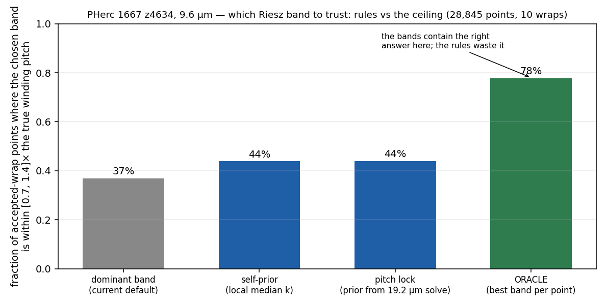

# Joint multi-band pitch resolution — premise PASSED, ceiling measured (2026-09-02)

**Question.** The local-frequency stage computes four steered-quadrature
bands and keeps one per pixel. At 9.6 µm the kept band is often a
face-split harmonic (fringe scale 1.39 fringes per winding,
`../../validation/fringe_scale`). Do the *other* bands carry the true pitch,
so that treating the bands jointly — an integer-ambiguity problem — could fix
the overcount?

**Truth.** PHerc 1667 z4634, 28,845 points on 10 accepted wraps; true pitch per
wrap = nearest-neighbour spacing to the next accepted wrap (pairs with
spacing < 40 px). "Correct" = chosen band's wavenumber within [0.7, 1.4]× the
true winding wavenumber.

**Premise (`jointband_premise.py`, criteria declared in the header).** Where
the dominant band is a face-split harmonic (18 % of points), a band at the
true pitch with amplitude ≥ 0.3× the dominant is present **54 %** of the time
(bar: promising ≥ 50 %, kill < 25 %). Unexpected: the dominant band sits
*below* the true frequency on another 35 % of points — selection errs in
both directions, not only the overcount.

**Rules vs ceiling (`jointband_rules.py`).**

| band-selection rule | correct |
|---|---|
| dominant amplitude (current default) | 36.9 % |
| self-prior (band nearest the local median of dominant k) | 43.9 % |
| pitch lock (prior from the 19.2 µm solve, as shipped) | 44.0 % |
| **oracle** (best of the four bands per point) | **77.8 %** |

**Reading.** The bands contain a correct pitch for nearly four points in
five; every per-pixel rule we have keeps it for fewer than half. The pitch
lock — the only intervention that has moved the scale bias so far — closes
only 17 % of the gap to the oracle. The remaining 22 % of points have no
correct band at all and need a different instrument (e.g. face pairing,
item 9.2). **Next (declared):** a joint assignment over all four bands with
spatial consistency along and across the sheet normal, scored against this
same protocol; worth shipping only if it closes ≥ 1/3 of the gap
(≥ 50.5 % correct) and does not lower the gauge M1/M2 on the same slice.
