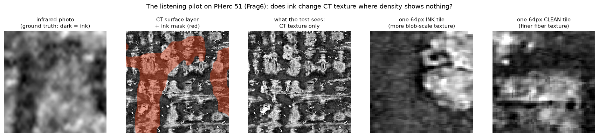
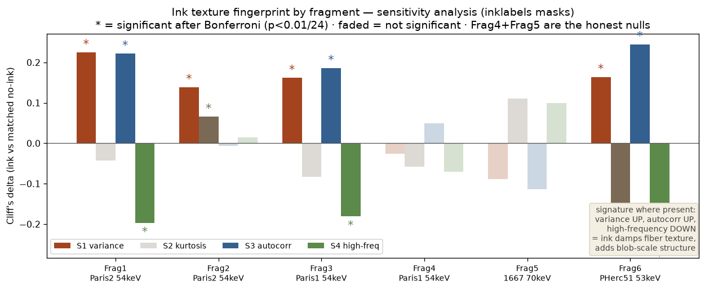

# Listening pilot: results (2026-08-31)

Question (preregistered before any data was touched —
`preregistrations/2026-08-31_listening_pilot.md`, commit 3c2199d; amendment
1 committed before analysis): does carbon ink leave a measurable texture
fingerprint in standard absorption CT, where it has ~no density contrast?

## The short answer

Yes, on 4 of 6 fragments, with modest effect sizes — and the result
survives the brightness confound on the two fragments where that check has
statistical power. Two fragments are honest nulls. One declared analysis
choice (the Otsu ink mask) failed on real data and is fully disclosed below.

## What happened, in order

1. **Preregistered run** (Otsu-on-IR masks, exactly as declared):
   verdict FINGERPRINT — S1 variance significant, same sign, in 4/6
   fragments. BUT our own mask diagnostic then showed the declared Otsu
   thresholding is invalid on several fragments: it classified 92%/95% of
   Frag1/Frag3 as "ink" (it splits illumination, not ink). The
   preregistered verdict therefore cannot be interpreted as an ink effect,
   and we do not claim it. (`listening_pilot_results.csv`)
2. **Sensitivity rerun** (post-hoc, labeled: provider-aligned
   `inklabels.png` as the mask for all six fragments; ink fractions a
   plausible 9–18% everywhere): **verdict FINGERPRINT again** — S1
   significant and positive in the same 4/6 fragments (Frag1 +0.22,
   Frag2 +0.14, Frag3 +0.16, Frag6 +0.16, Bonferroni-corrected p ≤ 2e-6;
   Frag4 and Frag5 null). S3 (lag-1 autocorrelation, positive) and S4
   (high-frequency fraction, negative) co-move in 3 of those 4.
   (`listening_sensitivity_inklabels.csv`)
3. **Confound analysis** (promised in the prereg): controls re-matched on
   patch mean intensity, one control per ink patch. On the two fragments
   with plausible masks AND large control pools, the signal survives:
   Frag6 all four statistics (|delta| 0.18–0.24, p ≤ 6e-26 after
   matching), Frag2 three of four. On Frag4/Frag5 the (already-null)
   effects die, consistently. Frag1/Frag3 could not be confound-tested
   under the preregistered masks (79/33 controls); re-testing them under
   inklabels masks is open work.

## Direction confound — tested 2026-09-01, closed

A hole in the analysis above: the S3 statistic averaged the x and y
autocorrelations, so a reconstruction artifact aligned with the sampling
grid was indistinguishable from real microstructure. The criterion was
declared before running (`listening_anisotropy.py` header): a signal
confined to one grid axis with near-zero diagonals is grid-locked and would
weaken the claim. Result (`listening_anisotropy_results.txt`, provider
masks): on Frag1, Frag3 and Frag6 the ink-vs-control shift appears on both
grid axes AND both diagonals at similar magnitude (diagonal deltas
0.18–0.25) — isotropic, as real microstructure should be and as a grid
artifact cannot be. Frag2's signal is in variance rather than correlation;
Frag4 stays null; Frag5 stays weakly reversed. No fragment is grid-locked.
Caveat carried: surface volumes are resampled along the surface normal, so
isotropy in this frame is evidence against a grid artifact, not proof of
physics.

## Reading

The signature — MORE variance, MORE short-range correlation, LESS
high-frequency power in ink regions — is what you would expect if ink
fills and coats papyrus fibers: fine fiber texture damped, larger-scale
structure added. It is weak (Cliff's delta ~0.15–0.25), far from a
per-pixel ink detector, and absent on 2 of 6 fragments (different scrolls
and scan energies; the prereg's no-pooling rule applies). It is, however,
a training-free signal in a channel the community's ink detection does not
currently use, and it is the empirical motivation for the dark-field
acquisition proposal: if this much microstructure signal survives
absorption reconstruction, a scatter-sensitive modality should see far
more.

## Files

- `listening_pilot.py` — the analysis (preregistered mode and
  `--mask-source inklabels` sensitivity mode)
- `listening_confounds.py` — the confound table generator
- `listening_pilot_results.csv`, `listening_sensitivity_inklabels.csv`
- Raw logs on request; every number regenerates with one command from
  public data.

## Prior art read 2026-09-02 — scope correction

Angelotti, Nicolardi, Henderson & Seales (Sci. Rep. 2026,
doi:10.1038/s41598-026-58467-1) show that in sub-micron optical heightmaps
of opened papyri a trained network separates ink from papyrus (Dice 0.89 at
0.34 µm), but that this surface-morphology signal is at the trivial baseline
by ≥ 3.4 µm pixel size, and that ink relief is not systematic (sign flips
between papyri). Full reading in `prior_art/topography_2026.md`. Consequence
for this pilot: nothing here is, or may be, a surface-relief claim. The S1–S4
statistics are near-surface CT intensity texture, a different observable;
the pilot stands or falls on its own controls, and it is cited here so that
no reader mistakes one for the other.

## Composition prior art read 2026-09-02 — the split stays unexplained

Brun et al. 2016 / Tack et al. 2016 measured lead in the ink of two
unidentified Paris fragments at 16 and 84 µg/cm² (5× apart). None of Frag1–6
has a published composition. A lead-carrying ink would add tens of percent
to voxel attenuation at 54 keV (`prior_art/ink_composition_2016.md`), which
is a candidate mechanism for a fragment-dependent signal — but Frag3 (signal)
and Frag4 (null) come from the same scroll, so composition does not explain
this pilot's split; it is recorded as untested, with a runnable ratio test
on the existing 54/88 keV volumes as the way to test it.
