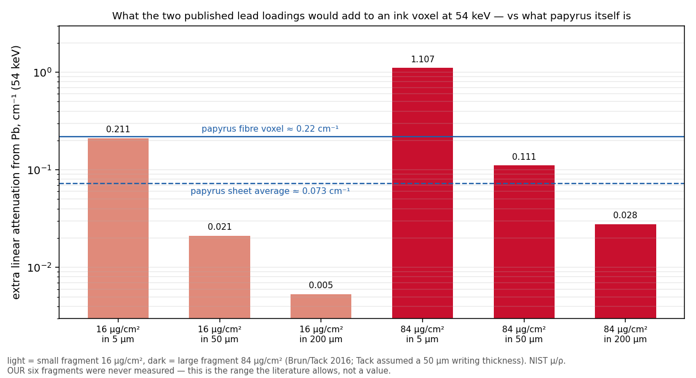

# Prior art: metallic (lead) ink in Herculaneum papyri — and what it does and does not explain

Read 2026-09-02, queue item "fragment ink-composition literature check."

**Sources.** Brun E. et al., "Revealing metallic ink in Herculaneum papyri,"
*PNAS* 113:3751–3754 (2016), doi:10.1073/pnas.1519958113. Tack P. et al.,
"Tracking ink composition on Herculaneum papyrus scrolls: quantification and
speciation of lead by X-ray based techniques and Monte Carlo simulations,"
*Sci. Rep.* 6:20763 (2016), doi:10.1038/srep20763 (open access).

**What they measured.** The **same two fragments** in both papers: pieces from
the Institut de France (Paris) collection that "unfortunately cannot be more
precisely identified" by PHerc number; ~0.9 × 1.2 cm and ~0.5 × 0.8 cm.
Synchrotron XRF (ESRF ID21), XRD, Pb-L3 and S-K XANES, Monte Carlo
quantification. Findings:
- Lead in the ink: **84 ± 5 µg/cm²** (large fragment) and **16 ± 5 µg/cm²**
  (small) — a **5× difference between two fragments of the same collection**.
- Also enriched in the writing: P, Al, Cl (and partly S).
- Speciation: Pb-L3 XANES resembles lead(II) acetate / carboxylates, with a
  possible partial PbS contribution (≤ 45 %); galena as pigment is
  "discouraged". Origin judged intentional (pigment or drier), not
  contamination (too much Pb; no Cu co-distribution).
- Their assumed writing thickness for the mass balance: 50 µm.
- Brun: "Individual scribes concocted their own inks, and one can expect
  variations." Neither paper claims all Herculaneum inks carry lead.

**Coverage of our fragments: none.** The Vesuvius Challenge fragments are
(volpkg names on the data server) Frag1 = PHerc.Paris.2 Fr47, Frag2 =
PHerc.Paris.2 Fr143, Frag3 = PHerc.Paris.1 Fr34, Frag4 = PHerc.Paris.1 Fr39,
Frag5 = PHerc.1667 Cr1 Fr3, Frag6 = PHerc.51 Cr4 Fr8. Frag1–4 are from the
same Paris collection as the two measured pieces, which makes lead
*plausible* there, but no composition measurement of any of the six exists in
print. The lead loading of our fragments is an unknown, and it spans at
least 5× where it has been measured.

**What the published loadings would mean in CT (order of magnitude,
`pb_attenuation_estimate.py`, NIST Hubbell–Seltzer µ/ρ).** Extra linear
attenuation in an ink voxel at 54 keV, if the ink occupies a layer of the
stated thickness, against a papyrus fibre voxel ≈ 0.22 cm⁻¹ (carbon at
1.2 g/cm³) or a sheet average ≈ 0.07 cm⁻¹:

| Pb loading | in a 5 µm skin | in 50 µm (Tack's assumption) | soaked through 200 µm |
|---|---|---|---|
| 16 µg/cm² | 0.21 cm⁻¹ (≈ fibre) | 0.021 (≈ 10 % of fibre) | 0.005 (≈ 2 %) |
| 84 µg/cm² | 1.1 cm⁻¹ (5× fibre) | 0.11 (≈ 50 % of fibre) | 0.028 (≈ 13 %) |

At 88 keV the answer depends on which side of the Pb K-edge (88.0045 keV) the
beam actually sat: µ/ρ is 1.91 below and 7.68 above, a 4× swing. A nominal
"88 keV" scan with a ~0.1 % bandwidth straddles it. **Consequence:** the
community's dual-energy (54 vs 88 keV) nulls do not, by themselves, tell us
whether lead is present — the experiment's sensitivity to Pb is undefined
without the beam's actual energy relative to the edge.

**What this does and does not explain in the listening pilot.**
- It *could* explain a fragment-to-fragment split: a lead-carrying ink with
  the large-fragment loading in a ~50 µm skin adds tens of percent to the
  voxel attenuation — a real intensity signal a texture statistic can pick
  up; an ink with little or no lead adds ~nothing. This is consistent with
  ink being learnable on some fragments and invisible on others.
- It does **not** cleanly explain *our* split. Frag3 (signal) and Frag4 (null)
  are two fragments of the **same scroll**, PHerc.Paris.1; a 5× composition
  difference within one scroll is possible (Brun's "individual scribes"; a
  second hand) but is a hypothesis with no evidence, not an explanation.
  Frag5 (PHerc.1667, null) and Frag6 (PHerc.51, signal) are single fragments
  from other scrolls and say nothing about composition either way.
- **Stays weak:** the pilot's split remains unexplained. The honest statement
  is that composition is unmeasured for all six fragments, that it is known
  to vary 5× between fragments where it was measured, and that a lead-driven
  intensity contrast is a *candidate* mechanism for the pilot's signal that
  would also make the signal trivially "density" rather than "texture."
  That candidate is testable on existing data (54 vs 88 keV volumes of
  Frag1–4 exist): a preregistered ratio test in ink vs non-ink voxels,
  with the K-edge caveat written in first. Not run here.
