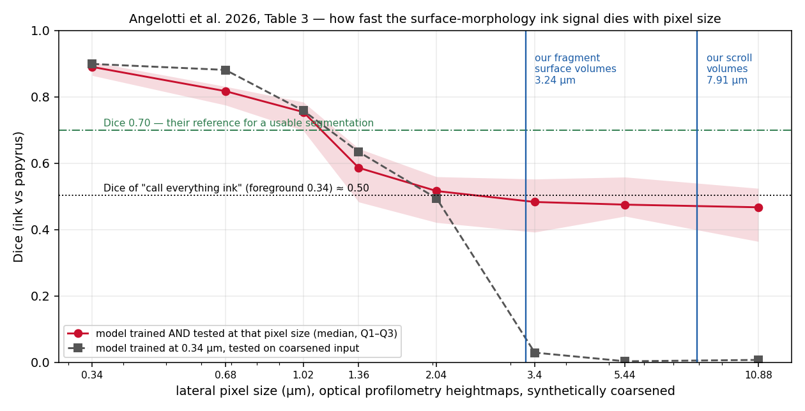

# Prior art: ink from surface topography (Angelotti, Nicolardi, Henderson, Seales 2026)

Angelotti G., Nicolardi F., Henderson P., Seales W.B., "Ink detection from
surface topography of the Herculaneum papyri," *Scientific Reports* (2026),
doi:10.1038/s41598-026-58467-1 (open access, CC BY-NC-ND). Read in full
2026-09-02 from the author manuscript. This note exists so that no texture or
morphology claim in this repository is made without knowing what this paper
already showed — and what it showed does *not* hold.

## What they did
- Optical profilometry (Sensofar S lynx 2, confocal) at **0.34 µm lateral
  sampling, 8 nm vertical**; 14 regions / 16 letters across PHerc. 248, 250
  and 500P2 (mechanically opened material); ground truth from co-registered
  brightfield photographs.
- 2D nnU-Net, 5 sample-level folds; also synthetic block-averaged coarsening,
  cross-resolution inference, isotropic-voxel (Δz = Δx) emulation, and
  leave-one-papyrus-out.

## What they found (numbers from their Tables 2–4)
| lateral pixel | Dice, trained+tested at that size | Dice, 0.34 µm model on coarsened input |
|---|---|---|
| 0.34 µm | 0.890 [0.864, 0.905] | 0.899 |
| 0.68 | 0.817 | 0.881 |
| 1.02 | 0.754 | 0.758 |
| 1.36 | 0.586 | 0.634 |
| 2.04 | 0.516 | 0.494 |
| 3.40 | 0.483 [0.392, 0.552] | 0.029 |
| 5.44 | 0.475 | 0.003 |
| 10.88 | 0.467 [0.364, 0.524] | 0.007 |

- Their usable-segmentation reference (Dice 0.70) is cleared only at
  **≤ 1.02 µm**. Isotropic-voxel emulation changes Dice by ≤ 0.026.
- **Derived here, not stated by them:** with foreground fractions of
  0.28–0.37, a classifier that labels everything as ink scores
  Dice = 2p/(1+p) ≈ 0.44–0.54. Their matched-resolution Dice at ≥ 3.4 µm
  (0.47–0.48) is therefore at or below the trivial baseline: in their data the
  morphological signal is *gone*, not merely weakened, at those samplings.
- Relief: detrended ink-minus-papyrus median offset +1.53 µm across samples,
  IQR [−7.47, +22.67] µm, **sign flips between papyri** (+14.7, −16.4,
  +20.1 µm). "The data do not support a systematic large positive ink relief"
  — contradicting the >100 µm relief reported from phase-contrast CT of the
  Paris scrolls.
- Roughness (residual RMS at σ = 3 px ≈ 1 µm, ink/papyrus): **0.39, 0.35,
  0.13** — ink smoother on every papyrus — but MAD of height is not unique to
  ink (36.7–38.7 µm ink vs 38.4–49.6 µm papyrus), and the authors say the
  roughness cue "in isolation, does not account for the observed segmentation
  performance."
- Leave-one-papyrus-out: mean Dice 0.691, weak on PHerc. 500P2 —
  transfer is papyrus-dependent.
- Their own scope statement: proof-of-concept on opened material, "rather
  than an immediately deployable reading method for unopened scrolls"; for
  sealed scrolls the open question is whether reconstruction preserves the
  effective surface detail, not the nominal voxel size.

## What this means for this repository
1. **No claim that ink is visible as surface height/relief in CT.** At our
   voxel sizes (3.24 µm fragment surface volumes, 7.91 µm scrolls) their
   heightmap signal is at the trivial baseline. Any relief-based ink argument
   at CT resolution is dead on arrival and will not be made here.
2. **The listening pilot measures a different observable.** Its statistics
   (S1–S4 in `../listening_pilot_results.md`) are computed on the CT
   *intensity texture of the near-surface volume* — which includes ink that
   has soaked into the fibre mat, i.e. subsurface density texture — not on a
   surface heightmap. Their null therefore does not refute it, but it removes
   "surface relief" as a candidate mechanism for whatever the pilot sees, and
   it sets the bar: the pilot's effect must survive scrutiny *without* a
   morphology story. Its stated weaknesses (Otsu mask failure, small sample,
   brightness confound tested but not fully excluded) stand.
3. **Scope of novelty, stated narrowly.** Theirs: supervised deep learning on
   sub-micron optical heightmaps of opened papyri. Ours: training-free
   texture statistics inside CT surface volumes with infrared ground truth.
   Different modality, different observable, different resolution regime. We
   cite them; we do not compete with them.
4. **Useful borrowed result:** ink is *smoother* than papyrus at the ~1 µm
   scale on all three papyri (roughness ratio < 1). If any CT-scale texture
   effect is real, "ink region has lower fine-scale variance" is the direction
   to expect, and the direction to check against — not "ink is rougher."
