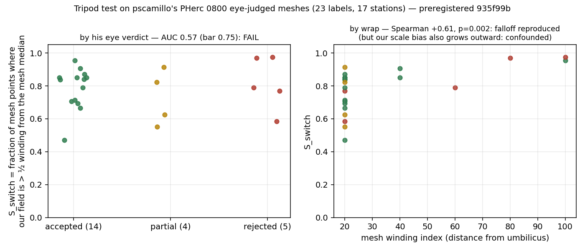

# Tripod test on PHerc 0800 — primary FAILED, secondary passed with a confound (2026-09-02)

Preregistration: `../../preregistrations/2026-09-02_verifier_tripod_test.md`
(commit 935f99b, before any score). External labels: pscamillo's eye-judged
verdicts on his own PHerc 0800 meshes (vesuvius-eligible-meshes,
`gate_verdict`), 23 meshes: 14 aprova, 4 parcial, 5 reprova. Our side: 17
pitch-locked L1 stations at each mesh window's z (`solve0800.py`, run with
one relaunch after a data-server HTTP 503; a 5-station partial score was
discarded unread, `tripod_scores_PARTIAL5_INVALID.json` on the box).

| declared criterion | result |
|---|---|
| PRIMARY: AUC(S_switch, aprova vs reprova) ≥ 0.75, bootstrap 5th pct > 0.5 | **0.571**, 5–95 % 0.27–0.86 → FAIL |
| PRIMARY alt: AUC(S_mad) | 0.529, 0.26–0.81 → FAIL |
| SECONDARY: Spearman(S_switch, wrap index) > 0 | **+0.607, p = 0.002** → pass |

**Reading.** On labels we did not make, our field-versus-mesh disagreement
does not predict whether a human calls a surface good. The scores show why:
S_switch is 0.47–0.98 on *every* mesh — the field is more than half a winding
from the mesh median on most points of most meshes, accepted or not. That is
the scale bias documented tonight (`../../validation/fringe_scale`,
`../ambiguity`, `../ratiometric_quality`, `../jointband`), and a biased
ruler cannot grade surfaces. The secondary result is real but not clean:
disagreement grows with wrap index as his verdicts do, and so does our bias,
so it cannot be claimed as verification. **The verifier claim is therefore
not externally validated**, and it stays that way until the bias is fixed
and this test is rerun under the same preregistration (replication set
0813/0211/0125 untouched). Files: `tripod_scores_0800.json`, `score0800.log`.
