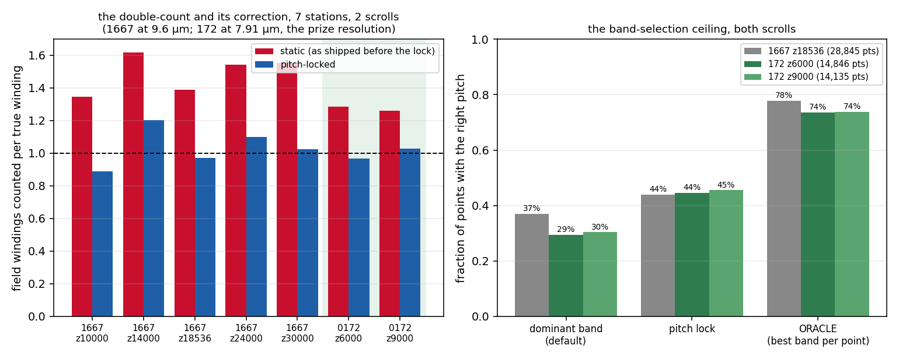

# Armour for the claims ledger — runs on existing data (2026-09-02)

## B4 — "the 9.6 µm claim rests on one slice" → repeated at four more stations
`b4_slices.py`, `b4_slices.json`. PHerc 1667, four new z stations spanning the
accepted meshes; per station the 19.2 µm solve → prior → 9.6 µm pitch-locked
solve, and the static 9.6 µm solve; per adjacent accepted-wrap pair, field
windings counted per true winding (1 = correct). Declared bar: overcount and
correction must reproduce at ≥ 3 of 4.

| station (full-res z) | pairs | static | pitch-locked |
|---|---|---|---|
| 10000 | 14 | 1.35 | 0.89 |
| 14000 | 8 | 1.62 | 1.20 |
| 24000 | 13 | 1.54 | 1.10 |
| 30000 | 15 | 1.55 | 1.03 |
| (original 18536) | 10 | 1.39 | 0.97 |

**4 of 4.** The static overcount is a property of the instrument at this
resolution, not of one slice, and the lock corrects it at every station,
imperfectly (0.89–1.20).

## C1 — "the gauge arm is one we assembled" → scored against the gauge's own mesh loader
`c1_gauge_mesh_arm.py`, `c1_gauge_mesh_arm.log`. Same adapter (step 9), same
gauge protocol (pitch 224, 2.399 µm/vox), two ground-truth arms: our point
file, and the gauge's `--gt-mesh` loader over the accepted meshes directly.
The mesh loader drops single-winding meshes, so its arm keeps 3 collections
/ 522 points against 3,679 for ours — a different, smaller sample.

| field | arm | M1 (τ) | M2 (τ) |
|---|---|---|---|
| static 9.6 µm | points | 0.132 | 3.70 |
| static 9.6 µm | meshes | 0.078 | 4.00 |
| pitch-locked | points | 0.200 | 2.37 |
| pitch-locked | meshes | 0.111 | 2.99 |

**Direction agrees under both arms** (lock raises M1, lowers M2). Magnitudes
do not agree within 20 % (M1 0.20 vs 0.11); the mesh arm is a different
sample and the absolute M1 should not be quoted from one arm alone. The
gauge run here also reproduced the box's earlier numbers (0.200 / 2.368) on
a different machine.

## A5 — "the second scroll has no ground truth" → it does: PHerc 172 at 7.91 µm
`a5_0172.py`, `a5_0172.json`. PHerc 172 (volume 20241024131838, 7.910 µm —
the prize scrolls' resolution) has 44 accepted per-winding segments
(w052–w095) on the public bucket. Two stations (z 6000, 9000; all 44 wraps
present on each), same recipe as 1667: 15.8 µm solve → prior → 7.91 µm
pitch-locked solve, and the static solve; true pitch from adjacent accepted
wraps (42 and 40 pairs — four times 1667's sample).

| station | pairs | true pitch | static | pitch-locked | band: dominant / lock / oracle |
|---|---|---|---|---|---|
| z6000 | 42 | 26.2 px | 1.28 | **0.97** | 0.29 / 0.45 / **0.74** (14,846 pts) |
| z9000 | 40 | 24.5 px | 1.26 | **1.03** | 0.30 / 0.45 / **0.74** (14,135 pts) |
| 1667 z18536 (reference) | 10 | — | 1.39 | 0.97 | 0.37 / 0.44 / 0.78 |

**Reproduced on a second scroll at the prize resolution, with a larger
sample.** The static double-count, the lock's correction, and the
band-selection ceiling are properties of the instrument at ~8–10 µm, not of
PHerc 1667. Every claim in `../fringe_scale` and `../../analysis/jointband`
now rests on two scrolls and seven stations.

## A4 — see below when complete
