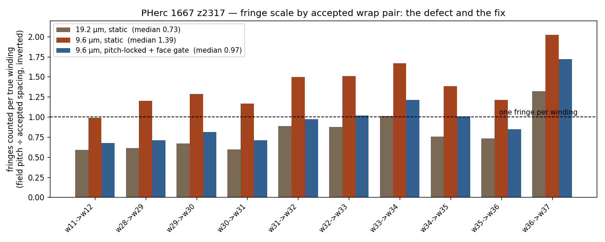
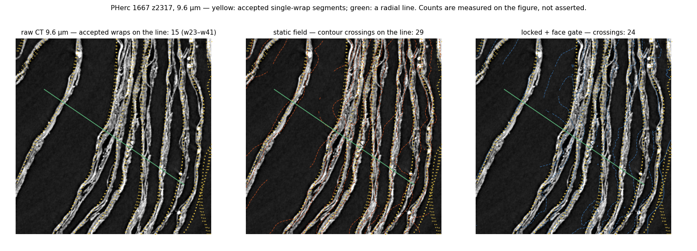

# Fringe scale by wrap — an independent second measurement (2026-09-01)

The constraint-gauge cross-check found the instrument recovers ~0.8 windings
per fringe at 19.2 µm from per-pair winding deltas. This is the same quantity
measured a different way: for each adjacent pair of accepted single-winding
segments on PHerc 1667 at z=2317, the true spacing is the median
nearest-neighbour distance from wrap w+1 to wrap w (2.399 µm frame, scaled to
level-3 pixels), and the field's implied pitch is the median of 1/|∇W| at the
same points.

| wrap pair | true spacing (px @19.2 µm) | field pitch (px) | field/true |
|---|---|---|---|
| w11→w12 | 6.1 | 10.3 | 1.69 |
| w28→w29 | 7.0 | 11.5 | 1.64 |
| w29→w30 | 7.7 | 11.5 | 1.50 |
| w30→w31 | 6.4 | 10.7 | 1.68 |
| w31→w32 | 9.4 | 10.6 | 1.13 |
| w32→w33 | 7.9 | 9.0 | 1.14 |
| w33→w34 | 9.1 | 8.9 | 0.99 |
| w34→w35 | 7.0 | 9.2 | 1.32 |
| w35→w36 | 7.4 | 10.2 | 1.37 |
| w36→w37 | 12.5 | 9.5 | 0.76 |

(w12→w13 excluded from the summary: its 37 px "spacing" says those two
accepted meshes are not physically adjacent in this slab.)

**Median field/true = 1.32, i.e. ≈0.73 windings per fringe — corroborating
the gauge's 0.8× by an independent method.** Two more things this table
says: the true spacing at 19.2 µm is 6–9 px, *at* the instrument's declared
6 px resolvability limit, so the undercount here is a resolution fact rather
than an algorithmic one; and where the true spacing is ≥9 px (w31–w34) the
ratio is 1.0–1.1. The operating envelope should be stated as roughly
"pitch ≥ 10 px at the analysis level".

**The same measurement at 9.6 µm (`fringe_scale_by_wrap_L2.json`):** true
spacing 12–19 px, field pitch 10–12.7 px, median field/true 0.72 — i.e.
≈1.39 fringes per winding, the face-splitting overcount, matching the
gauge's 1.4 at 9.6 µm. Both regimes of the fringe-scale finding are now
corroborated by an independent method. This also fixes the de-chirp gate:
at 9.6 µm the per-wrap ratio must move from 0.72 toward 1.0.

**A negative result that shaped the roadmap.** Three textbook pitch
estimators on radial profiles in polar coordinates about the umbilicus
(autocorrelation first-peak, cepstrum, and a chirp-rate search) all failed a
pre-declared 10 % gate here (`pitch_estimators_v2.py`), including after
per-wedge averaging and detrending. The reason is geometric: PHerc 1667's
cross-section is not circular, so radial lines cross sheets obliquely and
annuli by centroid radius do not correspond to winding order (`true_pitch.py`
shows the non-monotonic "annulus pitch" that exposed this). The field's own
normal-direction quadrature is the right geometry. Consequence for the
rotating-frame roadmap item: the de-chirp must be done in the **field's
frame** (resampling along iso-W contours) rather than in polar coordinates,
and its job at fine resolution is harmonic suppression (one fringe per
period), not extra resolution.

## Pitch lock, first iteration (2026-09-01)

`winding_phase.py` gained an optional pitch lock: given a prior wavenumber
per pixel (here the coarse 19.2 µm field's wavenumber, upsampled), the
quadrature band selection prefers the band within a log tolerance of the
prior instead of the strongest band. Default path is regression-verified
bit-identical. Result at 9.6 µm (`fringe_scale_by_wrap_L2_locked.json`):
median field/true **0.72 → 0.78**, span 59.3 → 55.8 (fewer spurious
fringes); inner accepted wraps improve most (w28→w29 0.83 → 0.95, w30→w31
0.86 → 0.98); the outer band barely moves. Diagnosis: the lock fixes the
frequency channel, but face-splitting also enters through the
ridge-adjacency constraints, which assert +2π between adjacent ridges
regardless of the locked frequency — each sheet face is a ridge. A
prior-gated minimum ridge spacing (`ridge_min_frac`) is the second declared
change; result below once measured.

## Pitch lock, second iteration: face gate on the ridge channel

With `ridge_min_frac=0.55` (a ridge closer than 0.55 locked wavelengths is
treated as the other face of the same sheet and marched past), the 9.6 µm
median field/true goes **0.72 → 0.78 → 1.03** (`fringe_scale_by_wrap_L2_locked2.json`).
Outer accepted wraps: w31→w32 1.03, w32→w33 0.98, w34→w35 0.99. Honest
spread: the inner wraps now *undercount* (w11→w12 1.48, w28→w29 1.41,
w30→w31 1.41) — the coarse prior there is inflated by the 19.2 µm
undercount itself, so the face gate rejects real neighbours. The declared
next step is to calibrate the prior by the measured 0.73 rather than widen
any tolerance; then the real criterion, the gauge at 9.6 µm.

## The declared gate, on the community's scorer — PASSED

The README roadmap declared, before any of this was built, that a de-chirped
9.6 µm solve had to beat the static 9.6 µm gauge numbers (M1 0.132 /
M2 3.70) on the identical ground truth and adapter protocol. Iteration 2
(pitch lock + face gate), scored by pscamillo's constraint-gauge unmodified
(`constraint_gauge_summary_9.6um_locked.json`):

| field @ 9.6 µm | M1 exact-dw1 | M2 MAE (windings) | coverage |
|---|---|---|---|
| static (dominant band, no lock) | 0.132 | 3.70 | 0.352 |
| **locked + face-gated** | **0.200** | **2.37** | 0.352 |
| (for reference: static @ 19.2 µm) | 0.190 | 2.47 | 0.352 |

M1 up by half, M2 down by a third, and the finer resolution is now the
better one — which is what the physics said should happen once the
face-splitting harmonic was suppressed. Density gate identical (SCORABLE,
ratio 0.39), same 3,679 GT points, same 200k pairs.

**Iteration 3 — calibrating the prior by the measured 0.73 — is an
over-correction, reported as such** (`fringe_scale_by_wrap_L2_locked3.json`):
per-wrap median 0.89, inner wraps improve (1.48 → 1.25) but outer wraps
worsen (1.03 → 0.81). The 19.2 µm undercount is not uniform (≈1.0 outer,
≈1.6 inner, see the first table), so a flat correction cannot be right by
construction. On the gauge it scores M1 0.168 / M2 2.86 — better than static, worse than
iteration 2. Iteration 2 is the result; a spatially varying calibration
would need ground truth we only have on this scroll, so it is not pursued.

Frame note: this is the "field-frame" de-chirp the negative result above
argued for — the prior comes from the field's own coarse solve along the
sheet normal, not from polar coordinates about the umbilicus.

## Figures (real data; counts measured on the figure, not asserted)

Fringes counted per true winding, per accepted wrap pair, for the three
fields. The 19.2 µm static field undercounts (median 0.73), the 9.6 µm
static field overcounts (1.39), and the locked field sits nearest one (0.97
on this inverted scale). w36→w37 is an outlier for all three: its measured
"spacing" of 25 px suggests those two accepted meshes are not physically
adjacent in this slab.

The same interior region at 9.6 µm with the integer contours of each field
drawn over the CT; yellow dots are the accepted single-wrap segments, the
green segment is one radial line. Crossings counted along that line: the
line meets 15 accepted wraps, the static field crosses **29** contours (the
red contours visibly run through the dark gaps between sheets — the
face-splitting), the locked field **24**. A partial correction, shown as
measured. Caveat: wraps w24–w27 are physically present on this line but
absent from the accepted set, so the true sheet count is somewhat above 15.
