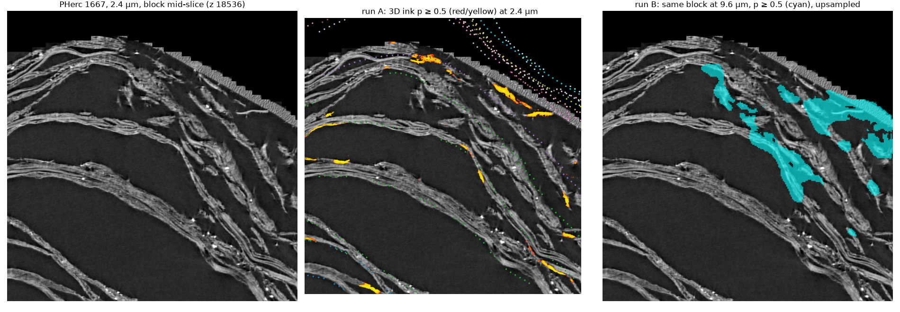

# 3D ink at prize resolution, and the winding field as page assigner — results (2026-09-02)

Preregistration: `../../preregistrations/2026-09-02_3d_ink_page_assignment.md`.
Block: PHerc 1667, 2.4 µm volume, z 18408:18664, y 2000:3024, x 6352:7376
(256 × 1024 × 1024), at the scroll's outer edge, 16 accepted wraps w018–w041.
Model `scrollprize/ink_3d_dino_guided` (`ckpt_78k_fullsup.pth`, EMA), the
organisers' inference tool, no TTA. Scripts: `fetch_block.py`,
`ink3d_analysis.py`; numbers in `ink3d_results.json`.

| run | result | declared verdict |
|---|---|---|
| A — 2.4 µm | 2.0 % of voxels p ≥ 0.5 (p99 0.94); thin deposits lying on sheet faces (figure) | ink-like output present |
| B — same block at 9.6 µm (4× mean-pooled, reflect-padded in z to one 256³ patch) | 8.1 % of voxels p ≥ 0.5; **Dice vs run A 0.087** (0.084 the other way) | **not useful at prize resolution** (bar: ≥ 0.5 useful, < 0.25 not) |
| C — page assignment, 105,878 ink voxels within 12 vox of an accepted wrap | **accuracy 0.380** | **kill** (pass ≥ 0.80, kill < 0.50) |

Run C per wrap (offset relative to w028):

| true wrap | n | accuracy | median (assigned − true) |
|---|---|---|---|
| w028 (reference) | 45,958 | 0.71 | 0 |
| w023 (5 wraps in) | 55,016 | 0.13 | **+2** |
| w018 (10 wraps in) | 3,822 | 0.00 | **+4** |

**Reading.** Run A gives the 3D-ink thread a real foothold on data we hold:
at 2.4 µm the model's output looks like ink on faces. Run B says the
capability does not survive the 4× downsampling that stands between that
scan and every prize scroll's — on one block, one patch, with reflect
padding, so a resolution experiment, not a verdict on the model. Run C fails
by exactly the instrument's known defect: +2 pages over 5 wraps, +4 over
10, the 1.4× overcount integrated outward. A page assigner needs a field
without that bias; nothing else about the design was tested. Caveats: the
block sits at the scroll edge; the winding field is one 9.6 µm slice applied
to a 256-voxel-thick block; human ink labels for 1667 were not available
and run A is not scored against them.
